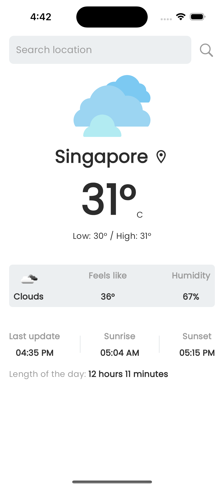
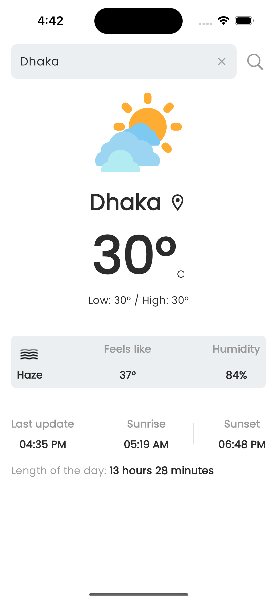
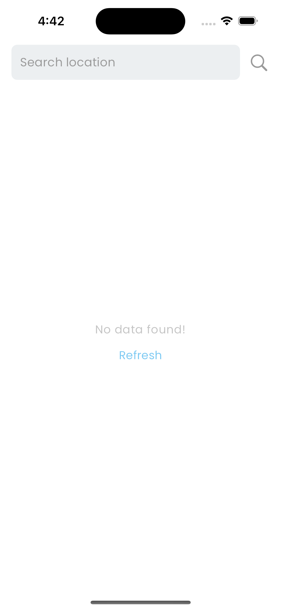

# Quick Weather App

# Description
A basic weather app that fetches and displays weather data from an open weather API based on user input (city name)

# Instruction to download project from git and run locally
To run the Flutter project locally by cloning the repository from this https://github.com/SujitSarkar/Quick-Weather-App.git link, follow these instructions:

### Note:
make sure you have flutter SDK installed in your machine. If not then follow the instruction from this https://flutter.dev/ link.

### Clone the Repository:
Open your terminal or command prompt and run the following command to clone the repository:

```https://github.com/SujitSarkar/Quick-Weather-App.git```

### Navigate to the Project Directory:
Move into the cloned project directory using the cd command:

```cd Quick-Weather-App```

### Install Dependencies:
Once you are inside the project directory, run the following command to install the required dependencies:

```flutter pub get```

### Setup API key:
First create .env file in the assets directory of this project. Then put the key in the variable named "API_KEY".
For example: ``` API_KEY = 'XXXXXXXXXXXXXXXXXXXXX' ```
You can get the api key from https://openweathermap.org/api.

### Run the Project:
After the dependencies are installed, you can run the Flutter project using the following command:

```flutter run```

This command will build the project and launch it on a connected device or emulator.


### Verify Installation:
Once the build process is complete, you should see the Flutter app running on your device or emulator.

That's it! You have successfully cloned the Flutter project from the given repository and run it on your local environment. You can now explore the project and make any necessary modifications.

### Project structure:
This project is structured by following MVC pattern. Also added service class for decoupling.

## App Screenshots
| Home screen                                    | Weather by city                                   |
|------------------------------------------------|---------------------------------------------------|
|                  |                     |

| No data fuond screen                           |                                                   |
|------------------------------------------------|---------------------------------------------------|
|                  |                                                   |